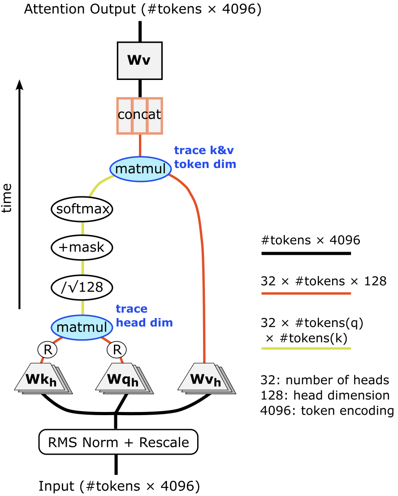

## Visualizing the inner world of a large language model (Llama 2 7B)

— Last update: 10/19/2023

This is a work in progress.  Comments or suggestions are welcome!  For longer messages, you can reach me at lawray.ai@gmail.com.

Comic courtesy of <a href = "https://www.smbc-comics.com/comic/conscious-6" target = "_blank" rel = "noreferrer noopener">SMBC</a>:  

It’s always been my philosophy that the best way to learn a model deeply is to hop into the code and track
variables through a few key scenarios.  Unfortunately, large language models (LLM) these days have billions
of parameters, so it’s difficult to develop a close feel for their internal structure at that level.

Still, there’s a lot of structure to the matrix values, even at a quick glance.  This post will give a tour of
select matrices within the 7 billion parameter Llama-2 model and explore some of what the model has in mind as
it generates text.  Llama-2 is a popular LLM that was released by Meta on July 21, 2023, with [this accompanying paper](https://arxiv.org/abs/2307.09288).  Some related learning resources are listed at the end of the article.

I’ll devote a short section to each of these topics:
1. What are the matrices, and how do they add up to 7B parameters?
2. What can we directly decode from internal states of the model?  
    2.A. Word association in the token encoding vector spaces  
    2.B. Internal dictionaries of an LLM
3. What do the first attention heads look for?
4. How do deep and shallow layers differ?
5. What do the layer outputs look like?
6. Lessons for LLM architecture
7. Useful links

### 1. What are the matrices, and how do they add up to 7B parameters?

 &nbsp;&nbsp; 
    
**Figure 1: (left) A Llama-2 transformer block, and (right) a Llama-2 7B attention block.**

#### The full set of matrices for Llama-2 is listed here.  Let’s tally the parameters: 
Input encoder and output layers that map between the model dimension (4096) and the token vocabulary (32000).  I’ll refer to both of these 32000x4096 matrices as token ‘dictionaries’ in the text below.  That’s 2 * 4096 * 32000 = 262,144,000 parameters.
1. Weight matrices for the transformer attention mechanism (Wk,Wq,Wv,Wo).  These are stored as 4096x4096 tensors in the Llama-2 download, but should be thought of as 32x128x4096 (or permutations thereof), as there are 32 attention heads.  That’s 4 * 40962 = 67,108,864 attention parameters per transformer.
2. It’s worth noting that these head-specific matrices act in pairs as WvhTWoh and WqhTRTRWkh, where the R matrices apply positional encoding. Each WqhTRTRWkh pair behaves very similarly to the LoRA representation of a larger 4096x4096 tensor.
3. Weight matrices for the feed forward network, which maps from the model dimension (4096) to a higher internal dimension (11008), and then back to the model dimension.  This would typically involve two linear layers (4096x11008 and 11008x4096), but Llama uses a SwiGLU activation for the first layer which requires an additional matrix.  That’s 3 * 4096 * 11008 = 135,266,304 feed forward parameters per transformer.
4. Note that there are 32 transformer layers, so one has 32 inequivalent versions of the matrices described in B-C!  Each layer also includes two 4096-long rescaling vectors within the Llama equivalent of batch normalization (RMSNorm), and I see one final rescaling operation on the last transformer output - I’ll touch on this in Section 5. There is also a vector containing 64 frequencies used to create the relative position encoding R matrices. Putting it all together, we get:

   262,144,000 word encoder + 64 position encoding frequencies +
   32 * (67,108,864 attention + 135,266,304 feed forward + 2 * 4096 RMSNorm) + 4096 final RMSNorm
= 6,738,415,680 total parameters

#### We’ll also take a look at several internal state matrices:
1. Attention matrices (#tokens x #tokens): Each attention head creates its own attention matrix, so if a context window contains 1000 input tokens, there will be 32 heads x 1000x1000 matrices per transformer layer.  However, with masked attention, only the bottom row of these attention matrices (a 1000-long vector) remains relevant for next-token generation.
2. The attention block outputs #tokens x 4096 state vectors that are added to the transformer inputs - this recombination with earlier states is called a persistent connection (see curved lines in Fig. 1, left).  These vectors are interesting, but do not need to be cached when running the model, and are not explored closely in the current version of this document.
3. After the attention block persistent connection, the #tokens x 4096 state vectors are fed into the feedforward layer, which acts on each 4096-long state vector independently - it is not synthesizing information between the different state vectors.  The feedforward layer outputs another set of #tokens x 4096 state vectors, which we’ll look at in Sections 2 and 5.  Only one of these 4096-long vectors needs to be created when generating a new token, however the previous vectors all need to be cached. Counting the first layer’s input as a 33rd ‘layer’, this suggests a minimum cache size of 270 MB for a prompt size of 1000. (270 MB = 33 layers x #tokens x 4096 x 2 bytes/float)
